# IELTS Pilot v0.9 产品功能说明书

本地优先的 IELTS 阅读与 AI 写作练习工作台

版本：0.9.0  
文档日期：2026-08-12  
交付形态：浏览器版、Windows 桌面版、Windows NSIS 安装包  
文档状态：已按生产构建与演示数据完成走查

> 重要说明：IELTS Pilot 不是 IELTS 官方产品，不包含官方真题，也不提供官方成绩。阅读 Band 与写作 Band 均为学习反馈，不能替代官方考试、认证考官评分或教师复核。

<!-- pagebreak -->

## 文档用途

本说明书面向产品体验者、二次开发者、内容维护者和部署人员，完整说明 v0.9 已实现的产品能力、用户操作路径、评分边界、数据与安全设计、部署方式、走查证据及当前限制。

## v0.9 一句话概览

IELTS Pilot v0.9 在原有阅读练习、模考、错题、统计、本地题库、加密同步、签名内容源和安全更新基础上，增加了 Academic Writing Task 1 / Task 2 工作室、结构化 AI 辅助评估、安全网关、桌面一次性 AI 配置、写作报告历史和可重复的本地演示档案。

## 版本亮点

| 领域 | v0.9 可用能力 | 核心边界 |
|---|---|---|
| 阅读 | 5 篇原创文章、54 道题、12 种题型、单篇练习与 40 题模考 | 本地规则评分，不是官方成绩 |
| 写作 | 原创 Task 1 / Task 2、字数与计时、草稿、AI 报告、证据回溯 | 用户确认后才发送作文 |
| 数据 | 本地自动保存、历史、收藏、批注、错题、备份、确定性合并 | 默认不需要账号 |
| 内容 | 内容包校验、题库编辑、ECDSA 签名目录与发布者信任 | 只导入有权使用的材料 |
| 交付 | 开发服务器、生产同源网关、Tauri 2、NSIS 安装器 | 开源安装器可能触发 SmartScreen |

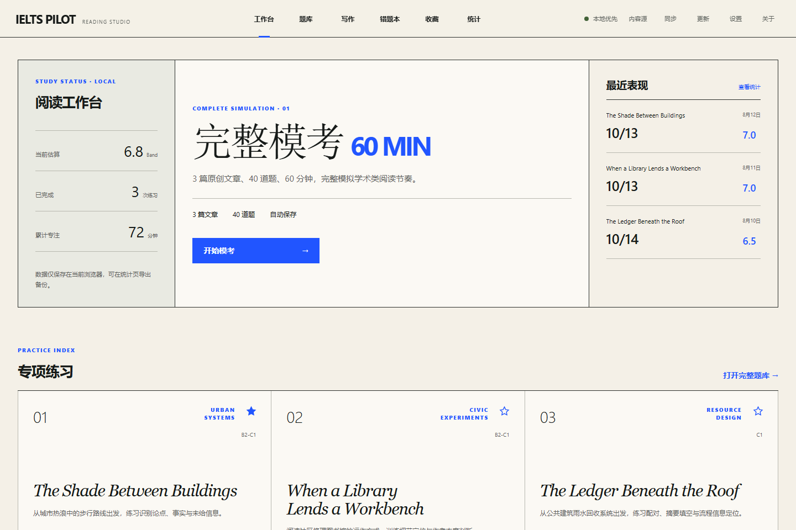

<!-- pagebreak -->

## 1. 产品定位与目标用户

IELTS Pilot 是一套面向自主学习和可控二次开发的本地优先练习工作台。它把内容、练习状态、评分结果和安全边界放在用户可见的位置，不把“AI”包装成不可审计的黑盒。

### 1.1 目标用户

- 需要在电脑上完成 IELTS Academic Reading 专项练习与完整模考的学习者。
- 希望记录错题、收藏、批注、趋势，并自行管理数据备份的长期学习者。
- 希望以公开四维量表获得写作修改线索，同时接受“辅助评估而非官方评分”边界的学习者。
- 需要维护原创或已授权题库、构建内容包和签名目录的教师或内容团队。
- 需要继续二次开发 Vue、TypeScript、Tauri 与本地 AI 网关的工程团队。

### 1.2 产品原则

- 本地优先：练习和报告默认保存在当前设备。
- 明确授权：同步、内容源信任和作文发送均由用户主动触发。
- 可审计：阅读评分规则、写作提示词版本、模型和请求编号可追溯。
- 原创优先：内置阅读、写作题目和演示作文均由项目原创并标注来源。
- 安全分层：浏览器密钥只在服务端；桌面密钥只在当前页面内存中。

## 2. 信息架构

顶层主导航提供工作台、题库、写作、错题本、收藏和统计；工具导航提供内容源、同步、更新、设置和关于。题库管理、题库编辑、练习、模考、阅读结果和写作报告作为子流程进入。

| 入口 | 主要任务 | 关键产物 |
|---|---|---|
| 工作台 | 查看状态、继续草稿、启动模考 | 最近成绩与练习入口 |
| 题库 | 搜索、筛选、收藏、开始练习 | 阅读练习会话 |
| 写作 | 选择任务、写作、提交辅助评估 | 本地草稿与写作报告 |
| 错题本 | 筛选错题、标记掌握、生成强化练习 | 动态强化题组 |
| 统计 | 查看趋势、题型表现、历史、备份 | 本地学习诊断 |
| 内容源 | 验签、信任发布者、下载内容包 | 已验证内容包 |

<!-- pagebreak -->

## 3. 启动与部署

### 3.1 浏览器开发模式

环境要求为 Node.js 20.19+ 或 22.12+。在仓库根目录执行：

```bash
npm install
npm run dev
```

开发模式适合前端调试和使用本地规则阅读功能。写作编辑仍可离线使用；若要调用真实 AI，应使用生产网关。

### 3.2 带 AI 的浏览器生产模式

```bash
npm run build
npm run serve:production -- --config "AI 配置文件路径" --port 4390
```

打开 `http://127.0.0.1:4390`。生产网关同时提供编译后的单页应用、写作健康检查和写作评估接口，并以同源方式避免把 API Key 暴露给浏览器代码。

支持两种配置：

1. JSON：包含 `endpoint`、`apiKey`、`model`。
2. 文本：接口提示、API Key、模型、完整 Chat Completions 地址依次分行保存。

也可使用 `IELTS_PILOT_AI_ENDPOINT`、`IELTS_PILOT_AI_KEY`、`IELTS_PILOT_AI_MODEL` 环境变量。配置文件和环境变量均不应提交到仓库。

### 3.3 Windows 桌面模式

开发模式额外需要 Rust stable、Microsoft C++ Build Tools 和 WebView2：

```bash
npm run desktop:dev
```

生成 NSIS 安装器：

```bash
npm run desktop:build
```

桌面版通过 Rust `reqwest` 与 rustls 发起 HTTPS 请求。Endpoint、模型和 API Key 由用户在写作页面临时输入，只保留于当前页面内存。

### 3.4 公网部署要求

- 在生产网关前配置 HTTPS 和访问控制。
- 按用户或来源实施限流，避免 API 额度被滥用。
- 将密钥保留在服务端配置或密钥管理系统，不放入 `VITE_*` 变量。
- 对日志进行保留期与访问权限管理；默认网关日志不记录作文与密钥。
- 若开放远程内容源，只信任 HTTPS 或明确允许的本机地址。

<!-- pagebreak -->

## 4. 演示数据与推荐走查路径

进入“设置 - 产品演示数据”，点击“准备演示数据”，阅读写入范围后再次确认。系统会幂等写入 3 次阅读记录、1 份暂停草稿、收藏、批注、掌握标记和 1 份写作演示报告。重复安装只刷新固定演示记录，不会删除现有用户数据。

推荐走查顺序：

1. 设置演示档案。
2. 工作台查看总体状态和最近成绩。
3. 进入练习，确认草稿、计时、答案与标记恢复。
4. 查看成绩、逐题解析、错题本、收藏和统计。
5. 打开题库编辑器和可信内容源，验证本地内容闭环。
6. 打开写作工作室，分别体验 Task 1 与 Task 2。
7. 确认作文发送范围，生成并检查 AI 报告。

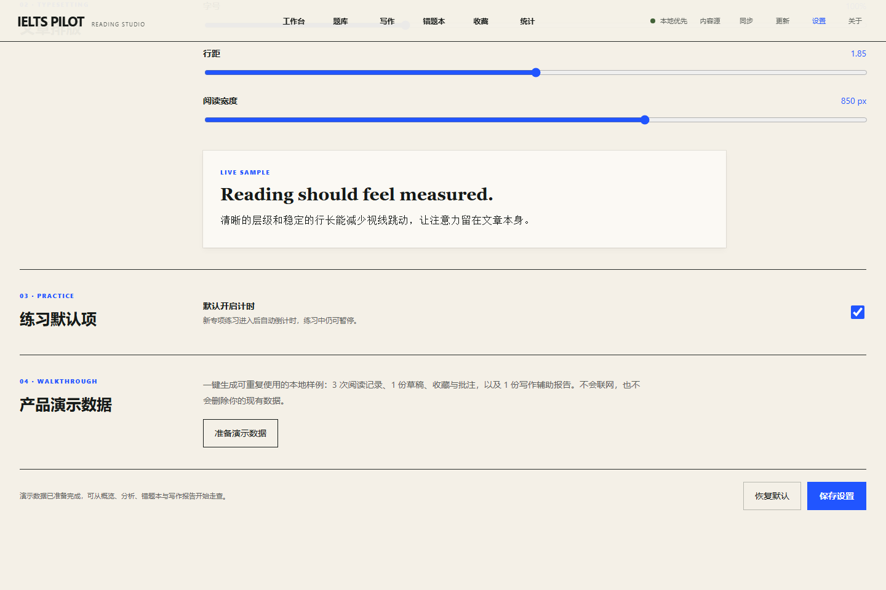

<!-- pagebreak -->

## 5. 阅读练习系统

### 5.1 默认原创题库

仓库内置 5 篇项目原创英文文章和 54 道题，不需要用户先导入题库。前三篇组成 40 题、60 分钟完整 Academic Reading 模考；后两篇用于专项扩展。

题型覆盖：单选、多选、True/False/Not Given、Yes/No/Not Given、标题配对、信息配对、特征配对、句尾配对、简答、句子填空、摘要选词和图示填空。

### 5.2 题库索引

题库支持关键词、难度和主题筛选，显示题量、建议时长、级别、最近成绩与草稿进度。文章可直接收藏，也可从卡片继续未完成练习。

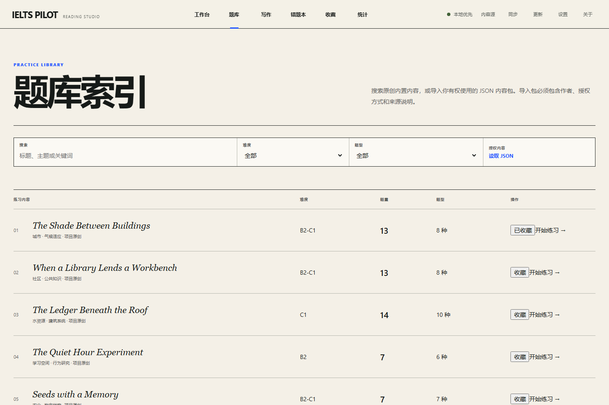

<!-- pagebreak -->

### 5.3 专项练习

练习界面采用原文与题目双栏布局，支持倒计时、暂停、自动保存、题目跳转、标记和移动端面板切换。演示草稿会恢复到第 5 题，并保留前四题答案和一个标记。

键盘快捷键：

- `J` / `K`：下一题 / 上一题。
- `F`：标记或取消标记当前题。
- `1` / `2`：移动端切换原文与题目。
- `Ctrl/Cmd + Enter`：提交。

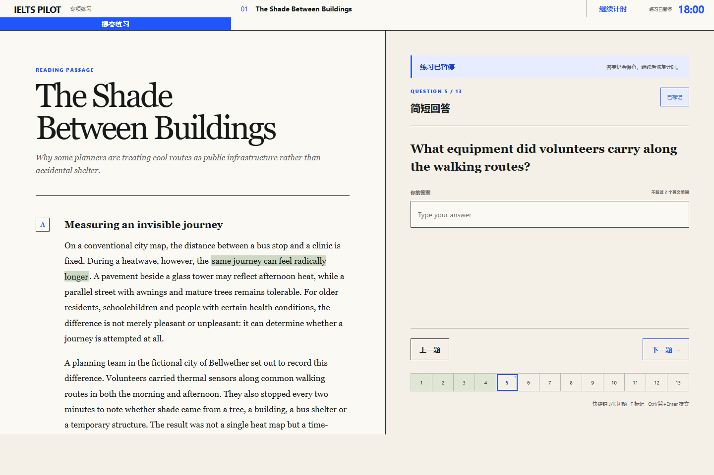

<!-- pagebreak -->

### 5.4 原文批注

用户可在原文中选择文本，使用三种颜色高亮并添加笔记。批注记录文章、章节、段落、起止偏移、选中文本、颜色、笔记和时间，删除与编辑均在本地完成。

### 5.5 提交与阅读评分

阅读评分完全由本地代码执行：

1. 选择与配对题按选项键匹配。
2. 多选题按无序集合比较，并校验选择数量。
3. 判断题支持常见等价输入，例如 `T`、`YES`、`NG`、`not-given`。
4. 简答与完成类题统一大小写、空格、Unicode 和首尾标点，并检查字数限制。
5. 单篇按正确率折算 40 题原始分；完整模考按 40 题直接计算。
6. 根据项目内置 Academic Reading 区间估算 Band，并记录 `reading-v2` 版本。

结果保留用户答案、可接受答案、正确性、解析和原文引用位置，便于复核。

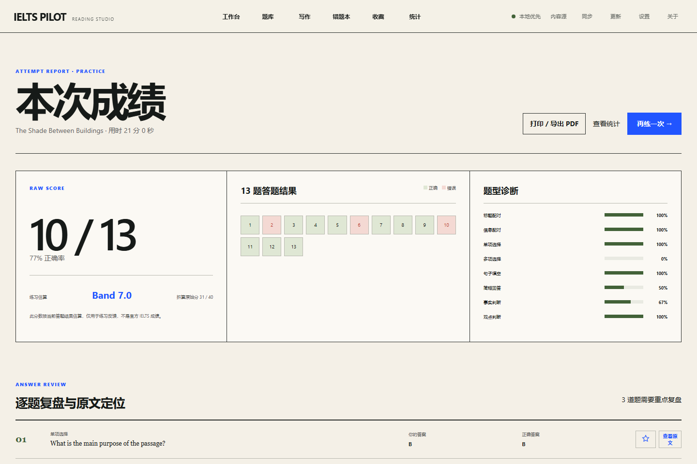

<!-- pagebreak -->

### 5.6 错题本与强化练习

错题本聚合历史错误，支持按题型、文章和掌握状态筛选。用户可标记掌握、收藏题目、回到原结果查看解析，也可以把当前筛选结果生成临时强化练习。

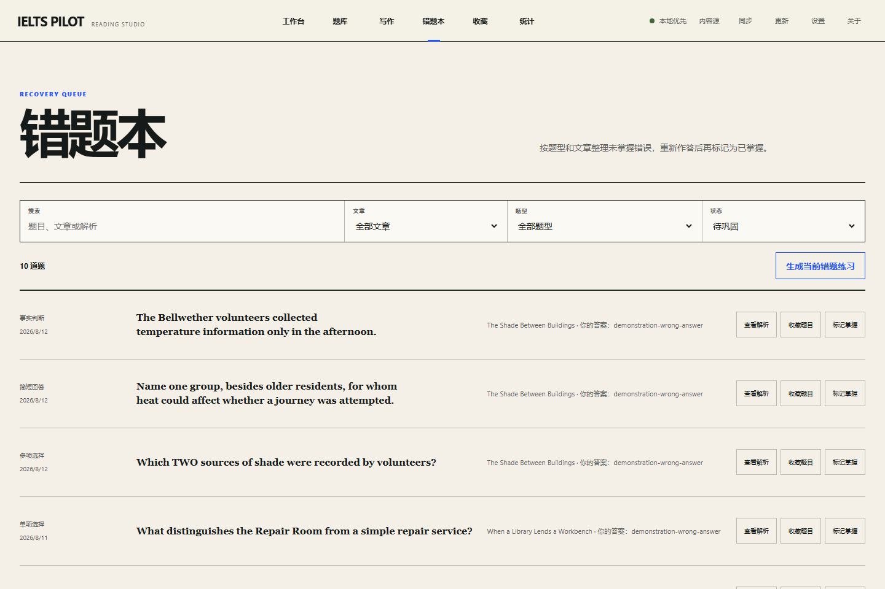

### 5.7 收藏与学习统计

收藏页分开显示文章与题目。统计页展示完成次数、平均 Band、最佳 Band、累计专注时长、最近五次正确率趋势、题型正确率和全部历史记录，并提供本地备份导入导出。

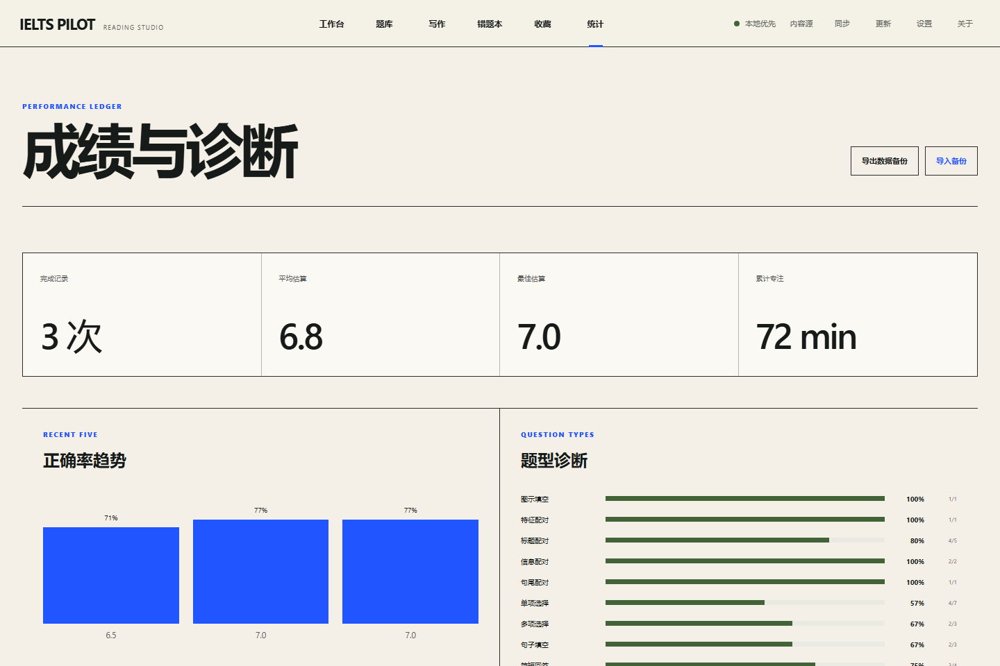

<!-- pagebreak -->

## 6. AI 写作工作室

### 6.1 内置任务

v0.9 内置两道项目原创 Academic Writing 任务：

| 任务 | 内容 | 最低字数 | 建议用时 |
|---|---|---:|---:|
| Task 1 | 虚构 North Quay Library 三类区域在 2019、2022、2025 年的周访问量图表 | 150 | 20 分钟 |
| Task 2 | 公共图书馆数字服务投入与安静实体自习空间之间的预算权衡 | 250 | 40 分钟 |

每道任务包含题目、写作要求、关注点、来源说明和原创演示作文。Task 1 的图表数据直接由应用数据渲染，不依赖外部图片。

### 6.2 编辑体验

- 任务切换与独立草稿恢复。
- Unicode 友好的实时字数统计。
- 计时和最低字数进度。
- 本地自动保存和手动清空。
- 一键载入原创演示作文。
- 历史报告列表。

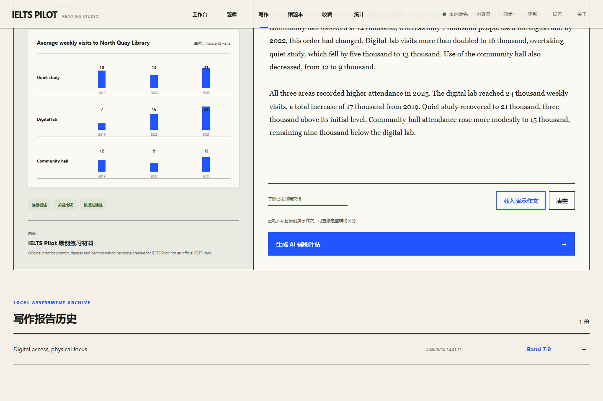

<!-- pagebreak -->

### 6.3 显式发送边界

点击“生成 AI 辅助评估”后，应用先检查最低字数，再显示确认对话框。对话框明确列出本次仅发送任务类型、题目、作文正文、字数和提示词版本；阅读记录、收藏、批注、同步口令和其他本地数据不会被发送。

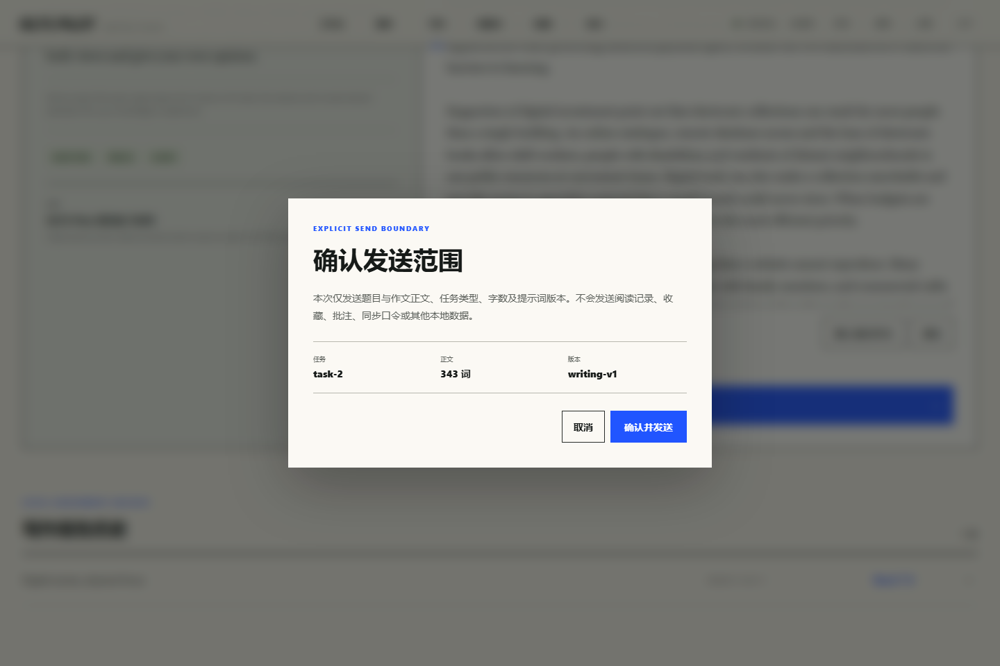

### 6.4 写作评分机制

写作不是一个外部 Codex Skill，而是项目内置的受约束 AI 评估流程：

1. 应用用 `writing-v1` 构建版本化系统提示词和用户消息。
2. 模型必须以 JSON 返回总体诊断、四项分数与理由、优点、优先修改项和原文证据。
3. 四项分数只允许 0 至 9 的 0.5 档位。
4. 应用验证四个维度是否完整且无重复。
5. 应用只保留能够在作文原文中逐字找到的证据引用，避免虚构引文进入报告。
6. 应用忽略模型给出的总分，独立计算四项等权平均并归一到最近的 0.5。
7. 报告记录模型、提示词版本、请求编号和生成时间。

四项维度为任务回应/任务完成、连贯与衔接、词汇资源、语法多样性与准确性。维度设计参考 IELTS 与 British Council 公布的写作评估信息，但模型输出仍可能存在遗漏、偏差或过度自信。

### 6.5 生产 AI 调用路径

浏览器版将请求发送到同源 `/api/v1/writing/evaluate`。Node 网关在服务端注入 Bearer 凭据，限制请求体、校验任务与提示词版本、设置超时，并只记录请求编号、模型、状态和耗时。

桌面版调用 Tauri 命令 `evaluate_writing`，由 Rust 验证 HTTPS Endpoint、消息数量和输入长度，再通过 rustls 发起请求。两条路径都显式关闭模型深度思考以控制响应时延，并要求 JSON 输出。

### 6.6 报告结构

报告包含辅助总 Band、总体诊断、四维分数和理由、已做好的部分、优先修改顺序、证据与改写建议、原始作文、模型与审计元数据，以及非官方评分免责声明。

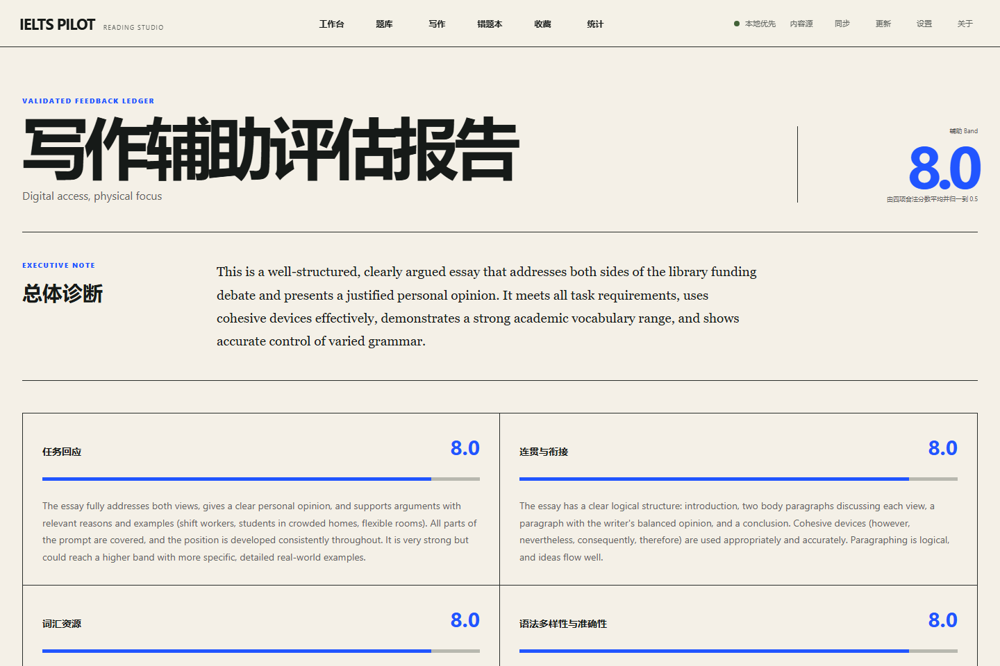

<!-- pagebreak -->

## 7. 内容包与题库编辑

### 7.1 本地题库编辑器

编辑器支持内容包元数据、文章章节、12 种题型、选项、可接受答案、解析与原文定位。草稿保存在本地，可校验并导出 JSON。导出的内容仍需要内容维护者确认版权和许可。

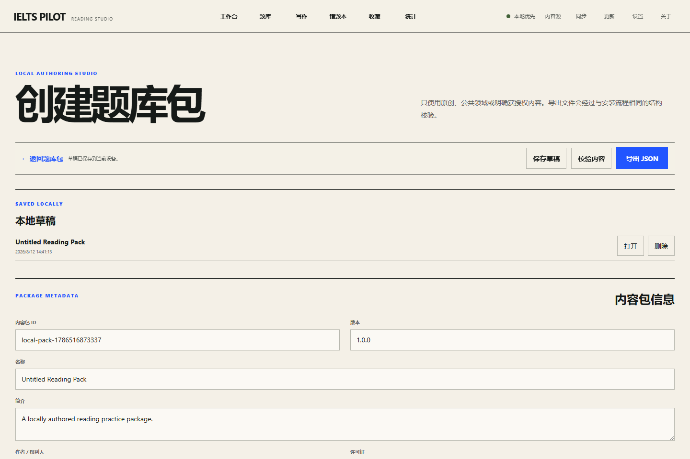

### 7.2 内容包安装

内容包使用声明式 JSON。应用先进行 schema 和字段校验，再计算 SHA-256、显示练习与题目数量、检查内置与已安装 ID 冲突、检查最低应用版本，最后由用户确认安装。卸载内容包不会删除历史成绩。

### 7.3 签名内容源

远程目录使用 ECDSA P-256 签名。应用验证目录签名后，要求用户核对并信任发布者公钥指纹；包下载完成后继续验证原始字节 SHA-256。发布者密钥发生变化时，下载会被阻止，直到用户明确确认新指纹。

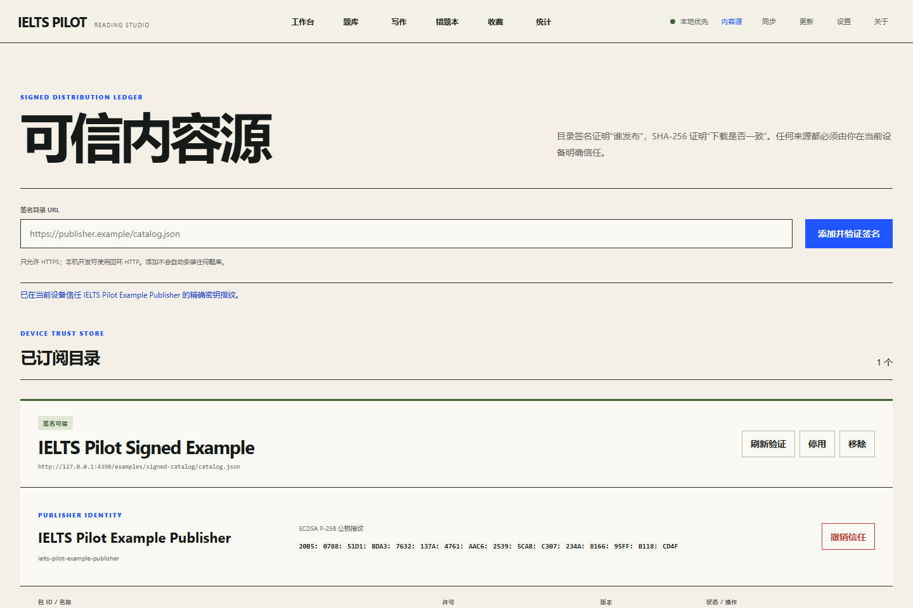

<!-- pagebreak -->

## 8. 本地数据、备份与同步

### 8.1 本地数据范围

阅读仓储键为 `ielts-pilot:practice:v4`，包含草稿、成绩、内容包、编辑器草稿、偏好、批注、收藏、掌握状态、实体时钟和删除墓碑。写作仓储键为 `ielts-pilot:writing:v1`，只保存写作草稿和已验证报告。

以下信息不会写入写作仓储：API Key、一次性桌面配置、原始上游响应和其他练习数据。

### 8.2 本地备份

统计页可导出 v4 JSON 备份，并导入 v2、v3 或 v4 备份。导入过程验证文件格式，失败时不覆盖现有状态。

### 8.3 端到端加密同步

同步流程使用 PBKDF2-SHA-256 派生密钥和 AES-256-GCM 加密保险库。同步口令和访问令牌仅保留于当前页面内存；服务端只保存密文。远程模式支持 HTTPS/本机 REST、强 ETag、并发冲突检测与重试。

多设备合并按实体时钟和删除墓碑确定性处理，用户在写入本机前能够预览合并结果。

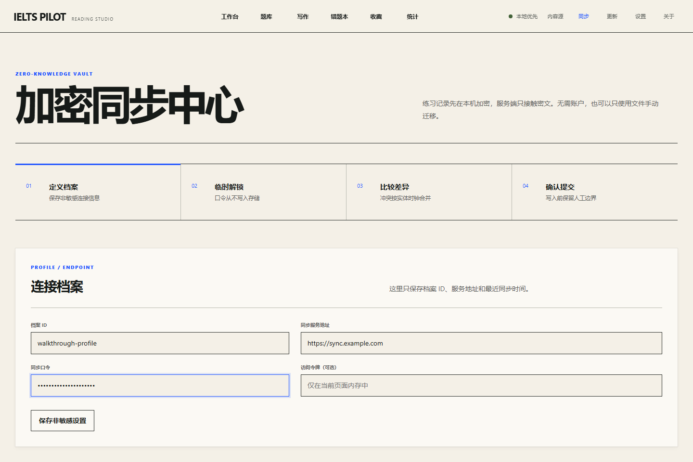

<!-- pagebreak -->

## 9. 应用更新与桌面交付

桌面更新中心通过 Tauri updater 检查 GitHub Releases 的 `latest.json`，只接受由项目 updater 私钥签名的更新产物。普通本地构建不生成 updater 签名；发布构建由独立命令和 CI 密钥完成。

NSIS 使用当前用户安装模式，无需管理员权限。项目没有内置商业 Authenticode 证书，Windows SmartScreen 可能显示“未知发布者”。正式发行应配置可信证书，并妥善备份 updater 私钥。

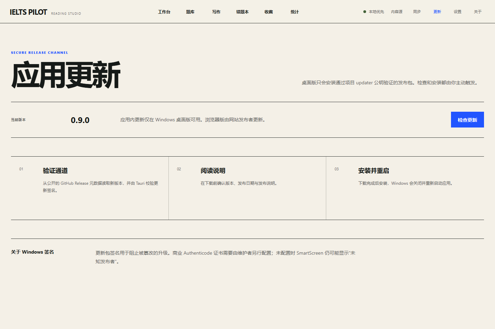

## 10. UI、响应式与可访问性

- 桌面端采用高信息密度的纸张式工作台，强调清晰边界、可读排版和电蓝色行动信号。
- 阅读正文提供纸张、护眼、夜间主题以及字号、行距与阅读宽度调节。
- 关键按钮、输入和对话框具有可见焦点状态。
- 状态反馈使用 `aria-live` 或 `role=alert`；写作确认对话框具有模态语义。
- 页面提供跳到主要内容链接，练习提供键盘操作。
- 820px 以下布局切换为单栏或移动面板，桌面 Tauri 窗口设置最小尺寸。

<!-- pagebreak -->

## 11. 安全与隐私边界

### 11.1 已实施的控制

- AI Endpoint 必须使用 HTTPS；仅本地测试允许 loopback HTTP。
- 浏览器 API Key 只存在于 Node 网关进程，不进入静态资源或浏览器存储。
- 桌面 API Key 只存在于当前页面状态和 Rust 命令参数，不写入磁盘。
- 网关请求体上限 32 KiB，作文上限 20,000 字符，提示词与消息均有长度限制。
- 上游超时、限流、不可用和非法响应转换为不含密钥的可恢复错误。
- 日志不记录作文、提示词或授权头。
- 内容包不执行脚本，只解析声明式 JSON。
- 签名内容源的发布者信任保存在当前设备，并与学习备份分离。
- 同步远端只看到加密保险库。

### 11.2 使用者责任

- 公网网关必须增加身份验证、HTTPS、限流和监控。
- 不应在公共电脑保留敏感作文或同步口令。
- 导入第三方题库前应确认原创、公共领域或明确授权状态。
- 高风险学习决策应由教师或认证考官复核。

## 12. 错误处理与恢复

| 场景 | 用户看到的结果 | 数据是否保留 | 建议处理 |
|---|---|---|---|
| AI 网关未启动 | 显示网关未连接 | 写作草稿保留 | 启动生产网关并重试 |
| 上游超时或限流 | 显示可恢复错误 | 作文和计时保留 | 稍后重试或检查额度 |
| 模型 JSON 非法 | 报告不写入 | 作文保留 | 重试或更换兼容模型 |
| 证据引文不存在 | 该证据被过滤 | 报告其他部分保留 | 人工对照原文 |
| 内容包 ID 冲突 | 安装被阻止 | 现有内容不变 | 修改包 ID 或移除冲突包 |
| 发布者密钥变化 | 下载被阻止 | 已安装内容不变 | 独立核对新指纹 |
| 同步 ETag 冲突 | 自动重新拉取与合并 | 本地状态不丢失 | 复核合并预览 |

<!-- pagebreak -->

## 13. 验证与验收记录

v0.9 验收覆盖以下层级：

- TypeScript 与 Vue 类型检查。
- 阅读、存储、同步、内容包、签名目录、写作评分、写作仓储、客户端和页面单元测试。
- AI 网关、同步服务与发布者 CLI 真实进程集成测试。
- Playwright 桌面与移动端 E2E。
- Tauri Rust `cargo check`。
- Vite 生产构建。
- Windows NSIS 安装器构建。
- 本机生产网关部署、真实模型健康检查和真实 Task 2 辅助评估。
- 19 张带演示数据的功能走查截图。

真实生产走查中，网关模型配置为 `doubao-seed-2.1-turbo`，实际响应模型标识为 `doubao-seed-2-1-turbo-260628`。成功请求只在日志中记录请求编号、模型、状态和耗时；密钥和作文未写入日志或仓库。

## 14. 当前限制

- 写作辅助评估依赖兼容 Chat Completions JSON 输出的外部模型，模型可用性与费用由提供方决定。
- 当前只覆盖 Academic Writing 的一组 Task 1 和一组 Task 2 原创演示任务，不是完整写作题库。
- 写作报告按单任务四维等权平均；产品不计算正式考试中 Task 2 双倍权重后的整场 Writing 总分。
- 当前没有口语、听力、词汇 SRS、托管账号、付费或官方评分能力。
- 浏览器 `localStorage` 容量有限；大量内容包或长期作文历史需要后续迁移到 IndexedDB 或本地数据库。
- 开源 Windows 安装包未必具有商业 Authenticode 签名。

## 15. 后续建议

1. 扩充原创写作题库并建立教师标注的评测集。
2. 为模型版本升级建立回归评估和一致性阈值。
3. 增加报告对比、逐段修改和人工批注导入。
4. 将写作历史迁移到可导出、可加密同步的数据格式。
5. 增加部署端身份认证、额度、审计和多租户隔离。
6. 在具备合法音频来源后开发听力训练；口语能力单独设计同意与音频隐私边界。

<!-- pagebreak -->

## 16. 版权、来源与免责声明

本项目在早期产品调研、功能范围和交互流程设计阶段参考了 [sallowayma-git/IELTS-practice](https://github.com/sallowayma-git/IELTS-practice)。仓库没有复制其源代码、题库、文章、音频、图片或其他受版权保护内容。

当前内置阅读文章、题目、写作任务、图表数据和演示作文均为 IELTS Pilot 项目原创练习材料，并在数据中标注作者、许可和非官方说明。“IELTS” 是相关权利人的商标，本项目与 IELTS 官方机构无隶属、认可或合作关系。

正式公开发布前，维护者仍应根据目标地区、内容来源、AI 服务条款和商业模式进行独立法律与许可证审查。

## 17. 参考资料

- IELTS Writing test preparation resources: https://ielts.org/take-a-test/preparation-resources/writing-test-resources
- British Council - How IELTS is assessed: https://takeielts.britishcouncil.org/teach-ielts/test-information/assessment
- British Council - IELTS Writing Band Descriptors: https://takeielts.britishcouncil.org/sites/default/files/ielts_writing_band_descriptors.pdf
- 项目 README、路线图、内容包格式、加密同步协议、签名内容目录协议和 Windows 安全发布文档。

## 附录 A：完整走查截图索引

| 编号 | 文件 | 走查功能 |
|---:|---|---|
| 01 | `01-settings-demo-profile.png` | 演示数据与阅读设置 |
| 02 | `02-dashboard-with-history.png` | 工作台与历史 |
| 03 | `03-reading-library.png` | 题库索引 |
| 04 | `04-reading-practice-autosave.png` | 练习草稿恢复 |
| 05 | `05-reading-result-review.png` | 阅读结果 |
| 06 | `06-error-book.png` | 错题本 |
| 07 | `07-favorites.png` | 收藏 |
| 08 | `08-learning-analytics.png` | 学习统计 |
| 09 | `09-package-editor.png` | 本地题库编辑器 |
| 10 | `10-signed-content-trust.png` | 签名内容源 |
| 11 | `11-installed-content-package.png` | 已安装内容包 |
| 12 | `12-encrypted-sync.png` | 加密同步 |
| 13 | `13-secure-updates.png` | 安全更新 |
| 14 | `14-about-and-attribution.png` | 版本与来源说明 |
| 15 | `15-writing-task-1.png` | Writing Task 1 |
| 16 | `16-writing-task-2.png` | Writing Task 2 |
| 17 | `17-writing-send-consent.png` | 作文发送确认 |
| 18 | `18-ai-writing-report.png` | 真实 AI 写作报告 |
| 19 | `19-ai-writing-evidence.png` | 原文证据与改写建议 |

## 附录 B：主要路由

| 路由 | 页面 |
|---|---|
| `/` | 工作台 |
| `/library` | 题库 |
| `/practice/:testId` | 专项练习 |
| `/mock/:mockId` | 完整模考 |
| `/result/:attemptId` | 阅读结果 |
| `/writing` | AI 写作工作室 |
| `/writing/report/:reportId` | 写作报告 |
| `/errors` | 错题本 |
| `/favorites` | 收藏 |
| `/analytics` | 统计与备份 |
| `/library/packages` | 题库包管理 |
| `/library/editor` | 本地题库编辑器 |
| `/library/sources` | 可信内容源 |
| `/sync` | 加密同步 |
| `/updates` | 应用更新 |
| `/settings` | 设置与演示数据 |
| `/about` | 关于与来源说明 |
