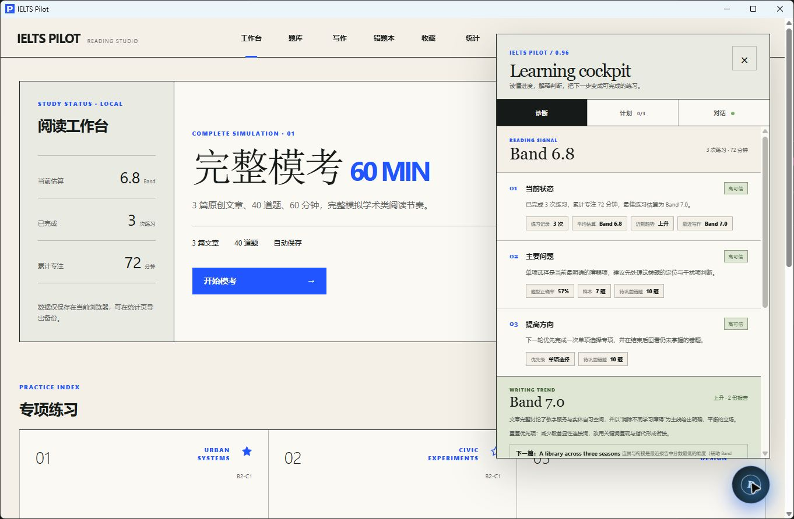
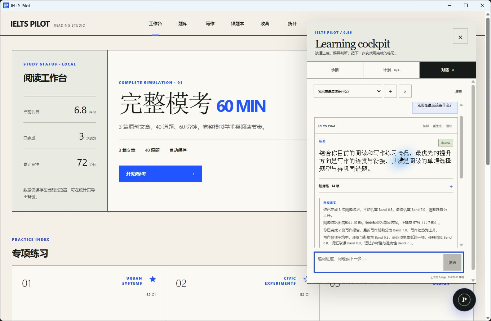
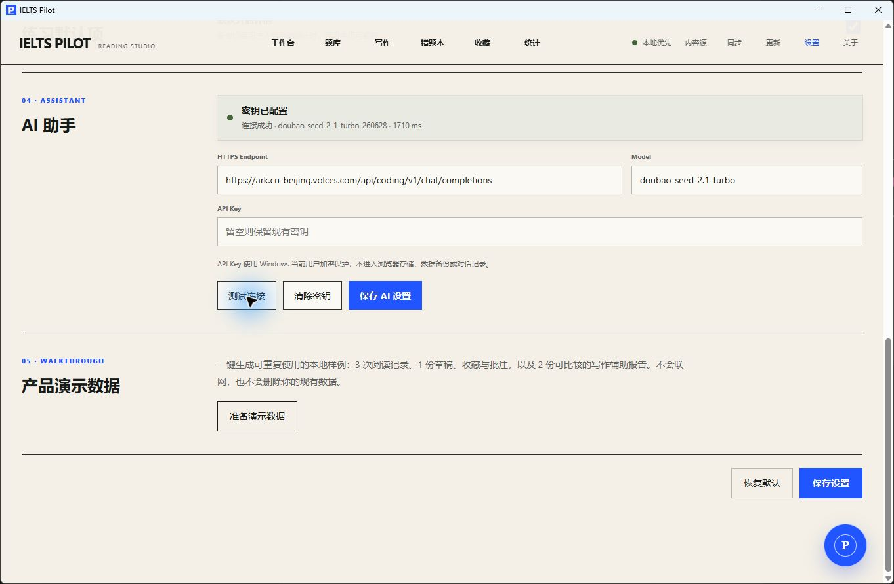

# IELTS Pilot v0.9.6 产品功能说明书

版本：0.9.6

适用平台：浏览器、Windows 10/11 x64

定位：本地优先的 IELTS 阅读、写作与学习行动工作台

## 1. 版本目标

v0.9.6 让 IELTS Pilot 从“展示诊断和建议”进入完整学习闭环：判断必须有本地证据，建议可以直接启动练习，练习完成后自动核对结果并生成下一轮任务；AI 对话支持真实流式输出，但只有通过结构与证据校验的最终回答才会进入历史。

## 2. 结构化 AI 与证据校验

- `assistant-v2` 要求固定返回结论、已知事实、基于事实的推断和下一步行动。
- 关键判断只能引用应用生成的稳定证据 ID；未知证据、外部 URL 和越权行动会被拒绝。
- 每项判断显示高可信、可参考或样本不足，并绑定样本数量；程序会降级没有足够样本支持的高可信判断。
- “成绩已稳定”“一定能提分”“官方成绩”等无证据或越界表述会被拦截；辅助 Band 始终标明不是官方 IELTS 成绩。
- 模型输出解析失败时不展示自由文本，而是回退到本地确定性建议并告知用户。
- 回答保留提示词版本、模型、请求编号和 Token 用量；回归语料持续覆盖夸大结论、未知证据和恶意行动。

## 3. 建议到练习的闭环

- 助手从薄弱题型、待巩固错题和写作报告生成具体行动。
- “开始专项练习”选择相关题型覆盖最多的文章；错题入口自动携带题型筛选。
- 点击行动后记录“已开始”，并保存创建时的正确率基线。
- 新作答产生后，应用自动匹配行动、计算练前/练后正确率；不足 5 题时明确显示样本不足。
- 已满足的行动自动完成；一轮完成后生成下一轮训练任务，不重复已解决项目。
- 今日/本周计划显示优先级、预计耗时、执行状态、结果和每周学习总结。

## 4. 对话体验

- 浏览器网关和 Tauri 桌面命令都支持 provider SSE 流式输出。
- 支持停止生成、失败重试、重新生成、复制回答、删除单条消息、清空和新建对话。
- 最多保留 12 个会话，每个 40 条消息；输入框显示最近 6 条上下文和字符用量。
- 流式片段只是临时预览，不写入本地；最终结构验证通过后才持久化。
- Markdown 使用类型化安全解析器渲染，不使用任意 HTML；危险协议链接和原始 HTML 保持为普通文本。

## 5. 写作深度接入

- 助手只读取最近五份报告的有界摘要、四维趋势、重复优先项和证据数量，不向模型发送作文原文或证据原句。
- 可从建议直接跳到对应报告的原文证据。
- 根据最新低分维度推荐下一篇原创写作任务，并显示预计耗时。
- 改写练习在本机根据报告证据构造，不把证据句额外发送给 provider。
- 所有写作 Band 均为基于公开量表的练习辅助估算，不代表官方成绩。

## 6. AI 配置与隐私

浏览器版通过同源本机网关调用，API Key 只存在于网关进程内存。Windows 桌面版通过 Rust HTTPS 命令调用，API Key 由 Windows 当前用户 DPAPI 加密后写入应用数据目录；重启应用后只能由同一 Windows 用户解密。

Endpoint 只允许 HTTPS，并拒绝 URL 中的用户名或密码。用户输入在保存和出站前检查常见凭据特征；疑似 API Key 不会保存也不会发送。密钥、作文全文和写作证据原句不会进入助手历史、备份、截图或仓库。

## 7. 演示走查

1. 打开“设置 → 产品演示数据”，确认安装固定档案。
2. 打开右下角悬浮球，在“诊断”核对 3 次阅读、写作趋势和证据可信度。
3. 在“计划”启动一条高优先级行动，并通过行动链接进入练习。
4. 在“对话”选择“我现在最应该练什么？”，观察流式响应、证据结构和三条本地行动。
5. 在设置中保存 AI 配置，重启桌面应用并确认“密钥已配置”；测试连接只显示模型和延迟，不回显密钥。

实机走查截图：

## 8. 安装、升级与更新

从 GitHub Release 下载 `IELTS.Pilot_0.9.6_x64-setup.exe` 后直接运行。安装器按当前用户安装，不需要管理员权限；覆盖旧版本会保留同一 Windows 用户的练习、报告、计划和设置。

应用内“更新”页面从 GitHub Release 获取 `latest.json`，并使用仓库内置 updater 公钥验证安装包签名。普通本地构建不包含 updater 签名；正式 Release 由 CI 中的私钥生成 `.sig` 和更新元数据。

## 9. 验收范围

- TypeScript 类型检查、全量单元测试、网关集成测试、Playwright 桌面/移动视口走查、生产构建和 Rust 测试。
- Windows NSIS 新装与覆盖安装、DPAPI 保存/重启读取、真实 provider 连接和真实流式对话。
- 断网、超时、限流、无效密钥映射均返回可恢复的中文提示；停止生成会取消活动流。
- Release 资产、`latest.json`、updater 签名和应用内检查更新均需完成实测。

## 10. 来源与权利说明

本项目早期产品调研、功能范围和交互流程参考了 [sallowayma-git/IELTS-practice](https://github.com/sallowayma-git/IELTS-practice)。仓库没有复制该项目源代码或题库；内置内容为 IELTS Pilot 原创练习材料。第三方题库转换工具只处理用户本机已有内容，使用者需自行确认相应权利。
